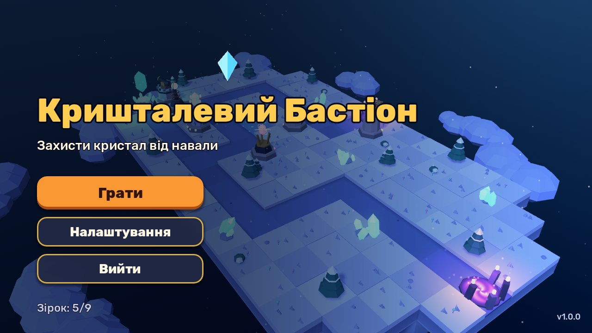
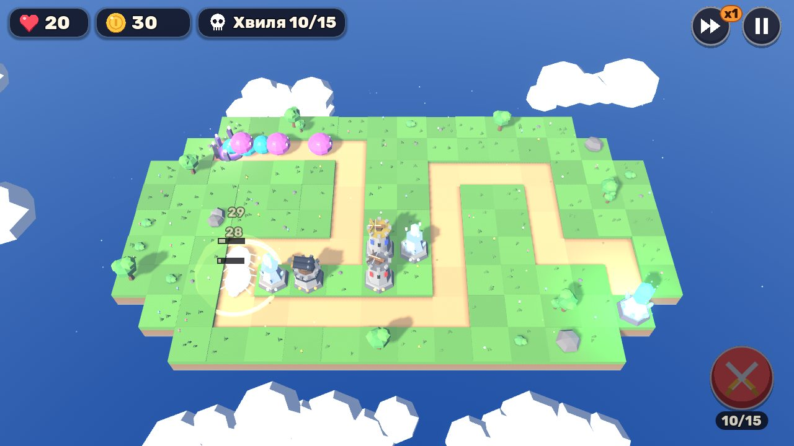
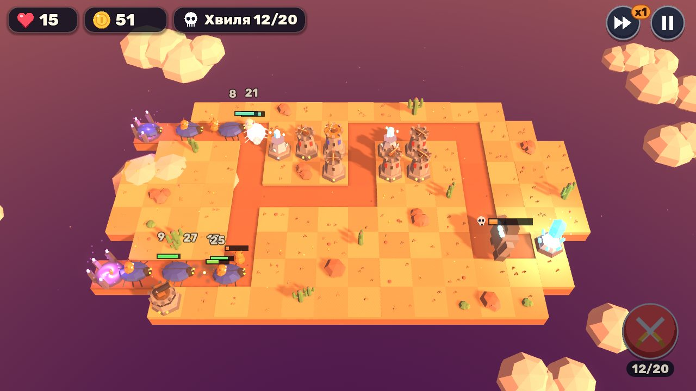
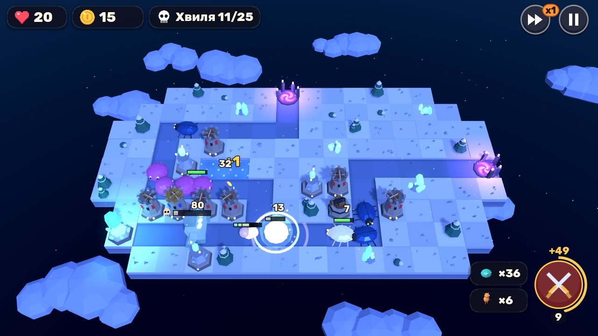

# Кришталевий Бастіон (Crystal Bastion)

3D tower defense для Android на рушії **Godot 4.7**. Острови в небі, низькополігональний стиль,
світні кристали, блискавки та промені. Уся графіка генерується кодом, тому дані гри займають
лише кілька мегабайт.



| Зелена долина | Багряний каньйон | Крижаний перевал |
|---|---|---|
|  |  |  |

## Що є в грі

- **3 рівні** з різним настроєм: денна долина, каньйон на заході сонця з двома входами,
  нічний крижаний перевал. Разом 60 хвиль.
- **5 веж**, кожна з трьома рівнями покращення і окремою моделлю на кожен рівень:
  - Лучна вежа: швидкі постріли по наземних і летючих;
  - Гармата: вибух по площі, лише наземні цілі;
  - Морозна вежа: сповільнює ворогів навколо цілі;
  - Вежа Тесли: блискавка перескакує між ворогами;
  - Кришталевий промінь: промінь посилюється, поки тримає одну ціль.
- **6 типів ворогів**: слизи, гобліни-бігуни, броньовані жуки, кажани (летять над стежкою),
  ділильники (розпадаються на малих слизів) і кам'яний голем-бос.
- Радіальні меню під палець: перший дотик показує прев'ю і радіус, другий підтверджує.
- Прев'ю наступної хвилі, бонус за ранній виклик, прискорення ×2/×3, пауза.
- Зірки за проходження, збереження прогресу, налаштування гучності, мови, графіки й вібрації.
- Українська та англійська мови. Мова визначається за мовою телефона.
- Режим «Економна графіка» для слабких телефонів: без тіней і світіння, нижча роздільність, 30 FPS.

## Чому Godot, а не Unity чи Unreal

- **Unreal** для мобільного tower defense надто важкий: APK від 150 МБ, складна збірка, високі вимоги до телефона.
- **Unity** підійшов би, але потребує редактора на ~10 ГБ і облікового запису. Збірка в CI вимагає ліцензійних ключів.
- **Godot** безкоштовний (MIT), без роялті, редактор важить ~100 МБ. APK збирається
  у GitHub Actions без жодних ліцензій. Гру можна запускати й тестувати автоматично,
  що й робилося під час розробки.

## Як встановити на телефон

1. Відкрийте вкладку **Actions** репозиторію і виберіть останній запуск **Android APK**.
2. Завантажте артефакт `crystal-bastion-debug-apk` і розпакуйте zip.
3. Скопіюйте `.apk` на телефон і відкрийте його. Android попросить дозволити встановлення з цього джерела.

## Як відкрити проєкт

1. Завантажте [Godot 4.7.2](https://godotengine.org/download) (стандартна версія, не .NET).
2. Відкрийте `crystal-bastion/project.godot` у Project Manager.
3. Натисніть **F5**, щоб запустити гру на комп'ютері. Миша працює як палець, колесо змінює масштаб.

### Збірка APK локально

Потрібні Android SDK (build-tools, platform-tools), JDK 17+ і шаблони експорту Godot 4.7.2
(Editor → Manage Export Templates). Далі:

```bash
cd crystal-bastion
./tools/build_android.sh          # подробиці та змінні оточення в коментарях скрипта
```

Для публікації в Google Play потрібен власний release-ключ і формат AAB (Gradle build).
Шаблон експорту вже налаштований, лишиться вказати ключ.

## Структура

```
crystal-bastion/
  project.godot              налаштування (Compatibility renderer, альбомна орієнтація)
  scenes/main.tscn           єдина сцена; все інше будується кодом
  scripts/main.gd            перемикання меню ↔ рівень
  scripts/autoload/          дані гри (вежі, вороги, хвилі), збереження, локалізація, звук
  scripts/game/              рівень, рельєф, вежі, вороги, снаряди, ефекти, камера
  scripts/ui/                HUD, радіальні меню, меню, налаштування, іконки
  scripts/dev/               бот-гравець, автотест балансу, скріншоти
  assets/                    шрифт Rubik (OFL), звуки й музика (згенеровані tools/gen_audio.py)
  tools/                     генератори звуку та іконок, скрипт збірки APK
```

Баланс змінюється в `scripts/autoload/game_data.gd`: ціни, шкода, здоров'я ворогів, склад хвиль.

## Інструменти розробника

```bash
# Бот проходить рівні на прискоренні й друкує результат (JSON)
godot --headless --path crystal-bastion --fixed-fps 60 -- --autotest --level=2 --skill=0.8 --seed=1

# Скріншот будь-якого екрана (потрібен GL, тому через xvfb на сервері)
xvfb-run -a godot --path crystal-bastion --rendering-driver opengl3 --resolution 1280x720 \
  -- --shot=/tmp/shot.png --screen=game --level=3 --play=60 --lang=uk
```

## Ліцензії

Код гри належить власнику репозиторію. Шрифт Rubik розповсюджується за SIL Open Font License
(`assets/fonts/OFL.txt`). Звуки й музика згенеровані процедурно скриптом `tools/gen_audio.py`.
