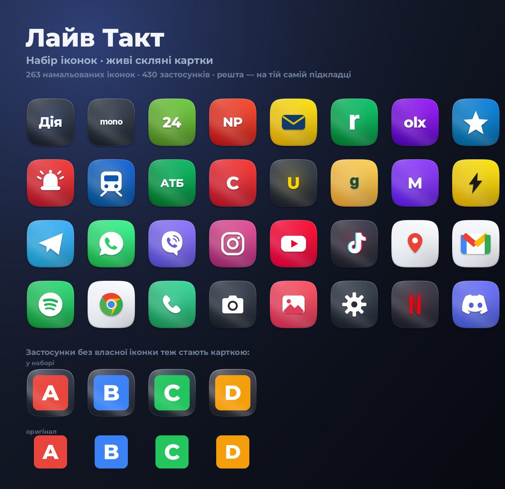

# Лайв Такт — набір іконок для Android

Набір іконок (icon pack) у стилі **живих скляних карток**: кожна іконка — це
squircle-картка з градієнтом бренду, м'яким світлом згори-зліва, діагональним
відблиском, скляним обідком і тінню. Поверх картки — впізнаваний знак
застосунку, перемальований з нуля у векторі.



## Що всередині

| | |
|---|---|
| Намальованих іконок | **263** |
| Застосунків (пакетів) | **431** |
| Відповідностей компонентів | **2248** |
| Формат | PNG 192×192 (xxxhdpi), `drawable-nodpi` |
| Мінімальна версія | Android 5.0 (API 21), цільова — API 34 |
| Підпис | APK Signature Scheme v1 + v2 |

Покриття:

* **Україна** — Дія, Армія+, Резерв+, Мрія, Київ Цифровий, Повітряна тривога,
  monobank, Приват24, Sense, ПУМБ, Ощад, A-Bank, izibank, Raiffeisen, OTP,
  UKRSIB, Credit Agricole, NovaPay, Sportbank, Нова пошта, Укрпошта, Meest,
  Justin, Rozetka, OLX, Prom, Kasta, Shafa, Сільпо, АТБ, Varus, Novus, Fora,
  Аврора, EVA, Comfy, Foxtrot, Allo, Епіцентр, AUTO.RIA, Work.ua, Robota.ua,
  Uklon, Укрзалізниця, WOG, OKKO, SOCAR, Fishka, Київстар, Vodafone, lifecell,
  Megogo, sweet.tv, Суспільне, УП, УНІАН, ТСН, НВ, Multiplex, Планета Кіно,
  ukr.net, Sinoptik, Helsi, Liki24, Tabletki, Аптека 911, Ajax, YASNO,
  EasyPay, Portmone, iPay, Zakaz, Auchan, METRO та інші.
* **Світові** — месенджери, Google, Microsoft, соцмережі, музика й відео, ігри,
  маркетплейси, банки й крипта, браузери та VPN, AI-застосунки, лаунчери.
* **Системні** — телефон, повідомлення, контакти, камера, галерея, годинник,
  калькулятор, налаштування, файли, календар для Pixel/AOSP, Samsung і Xiaomi.

### Застосунки, яких немає у списку

Для них у `appfilter.xml` описані `iconback`, `iconmask`, `iconupon` і `scale`:
лаунчер бере оригінальну іконку застосунку, зменшує її та кладе на ту саму
скляну картку з обідком. Тобто домашній екран виглядає цілісно навіть там, де
намальованої іконки ще немає.

## Встановлення

1. Скопіюйте `dist/LiveTakt-IconPack-1.0.apk` на телефон і встановіть
   (потрібно дозволити встановлення з невідомих джерел).
2. Відкрийте застосунок **Лайв Такт** і натисніть кнопку свого лаунчера, або
   застосуйте набір вручну: налаштування лаунчера → «Тема іконок» / «Набір
   іконок» → Лайв Такт.

Підтримувані лаунчери: Nova, Lawnchair, Smart Launcher, Niagara, Apex, ADW,
Action, Microsoft Launcher, POCO/MIUI (через сумісні теми) та інші, що читають
формат ADW `appfilter.xml`.

> Складання підписує APK ключем, який генерується локально й **не** зберігається
> у репозиторії. Якщо перезібрати пак на іншій машині, ключ буде інший — тоді
> перед встановленням нової версії стару треба видалити.

## Як зібрати

```bash
python3 -m pip install pillow cairosvg numpy cryptography fonttools
python3 build/build.py            # повна збірка в dist/
python3 build/build.py --icons    # тільки перемалювати PNG
python3 build/preview.py          # промо-зображення
```

Потрібні лише JDK 21 і Python 3. Android SDK не потрібен: `build/build.py`
сам завантажує з Maven Central те, що треба, і складає APK:

| Крок | Чим |
|---|---|
| Ресурси | `aapt2` та framework-ресурси з дистрибутива apktool |
| Байткод | `javac` проти мінімальних стабів у `android/stubs` + `dx` |
| Пакування | `build/apkzip.py` — вирівнює `resources.arsc` на 4 байти |
| Підпис v1 | `jarsigner` з JDK |
| Підпис v2 | `build/v2sign.py` |
| Перевірка | `com.android.apksig` (ApkVerifier) + перевірка вирівнювання |

Так вийшло тому, що в середовищі збірки немає доступу до `dl.google.com`, а
`apksig` 2.3.0 не вміє підписувати v1 на JDK 21 (він звертається до
`sun.security.pkcs`). Перевірка підпису робиться саме бібліотекою Google — тобто
v2-блок, згенерований тут, валідується незалежною реалізацією.

## Як додати застосунок

1. Опишіть його в `src/apps_ua.py`, `src/apps_world.py` або `src/apps_system.py`:

```python
App("slug", "Назва", brand("#RRGGBB"), M("mark_name"), scale=0.52,
    packages=["com.example.app"],
    components=["com.example.app/com.example.app.MainActivity"])
```

   `brand()` малює картку з кольору бренду, `graphite()` / `porcelain()` — нейтральну
   підкладку для різнокольорових знаків. Знак — це або `M("...")` з `src/marks.py`,
   або літерний `T("Дія")`.

2. Якщо точна activity невідома — достатньо `packages`: збірка додасть
   найтиповіші варіанти (`.MainActivity`, `.ui.MainActivity`, `.SplashActivity`…).
   Зайві записи нікому не заважають, вони просто ніколи не збігаються.

3. `python3 build/build.py` — збірка перевіряє каталог (невідомі знаки,
   відсутні в шрифті символи, дублікати компонентів) і падає до рендеру, якщо
   щось не так.

## Структура

```
src/style.py        картка: squircle, градієнти, світло, обідок, тінь
src/marks.py        векторні знаки (SVG у координатах 100×100)
src/glyphs.py       рендер SVG та літерних знаків
src/catalog.py      модель застосунку + генерація компонентів
src/apps_*.py       каталог застосунків
src/render.py       рендер іконок, iconback / iconmask / iconupon
android/            маніфест, дашборд, ресурси, стаби Android API
build/              збірка, пакування, підпис, перевірка, промо
```

## Про логотипи

Усі знаки намальовані у векторі спеціально для цього набору — це стилізовані
впізнавані форми, а не витягнуті з чужих застосунків файли. Назви та логотипи
належать їхнім власникам; набір не пов'язаний із жодним із цих брендів.

Шрифти для літерних знаків (Montserrat, Inter, Manrope) використовуються лише
під час рендеру, у APK вони не потрапляють — див. `assets/fonts/OFL-NOTICE.txt`.
